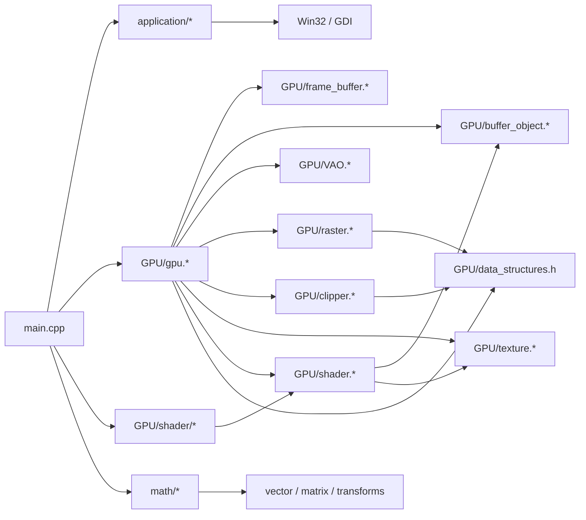

# SoftRenderer 仓库深度评估报告

## 执行摘要

这套 `SoftRenderer` 目前**更像一套教学型、单线程、立即模式的软件渲染器**，而不是一套可扩展的 CPU 渲染内核。它的数学流程基本完整：有顶点处理、裁剪、透视除法、屏幕映射、光栅化、片元着色、深度测试与混合；但**性能架构上存在几处足以决定上限的硬伤**：  
一是 `GPU::draw_element()` 把光栅化结果先完整塞进 `std::vector<VertexShaderOutput>`，等于先“制造一整车片元”，再逐个做片元着色和深度测试；二是**片元着色发生在深度测试之前**，遮挡失败的片元照样会去采样纹理和做颜色计算；三是光栅化对每个像素重复做边函数/面积计算，没有使用增量 edge function；四是渲染状态和资源访问大量依赖 `std::map` 查找与拷贝，缓存友好性差；五是整体状态机与单例设计完全没有为并发做准备。fileciteturn22file0L1-L1 fileciteturn28file0L1-L1 fileciteturn36file0L1-L1 fileciteturn39file0L1-L1

如果把目标定为“在 x86_64 多核 CPU 上认真提速”，那么**优先级最高的改造顺序**应当是：  
先消灭“片元向量物化”和“先着色后深度”的顺序问题；再把三角形光栅改成**增量 edge function + 单次 setup、逐像素递推**；随后引入**tile binning + tile owner** 的并行设计；最后再做 SIMD/AoSoA、纹理布局、内存池和分配器优化。照这个顺序做，收益最大，返工最少，也最符合工业上 CPU 软件光栅器的经验：Intel 的软件遮挡/光栅化资料明确强调了**分 tile、避免多线程同时写同一像素、提高 cache coherence、配合 SIMD 与任务调度**；Mesa 的 llvmpipe 和 OpenSWR 也都把多核并行和向量化当成基本盘，而不是锦上添花。citeturn7search1turn7search2turn8search8turn9search4

就“是否存在重大架构问题”这个问题，结论很直接：**有，但主要是性能架构问题，不是渲染数学完全错误**。这套代码在 720p、少量三角形、单线程演示里当然能跑；可一旦把目标换成高分辨率、较高 overdraw、几十万到上百万三角形、或者 4~16 线程扩展，它的当前设计会非常快地把 CPU 和内存系统拖进泥里。尤其是现在 `main.cpp` 只渲染 3 个三角形，根本不足以反映真实性能上限；如果继续拿这个 demo 来评估“并行化值不值得”，结论大概率会被误导。fileciteturn58file0L1-L1

还有一个不太体面的现实问题：仓库**并不真正 Linux/Windows 双适配**。`main.cpp` 和 `application` 明确绑定 Win32/GDI，入口是 `wWinMain`，窗口与画布创建依赖 `Windows.h`、`CreateDIBSection`、`BitBlt`；同时，顶层 `CMakeLists.txt` 和 `main.cpp` 使用小写 `gpu/...`，但仓库真实目录是 `GPU/`。在大小写敏感文件系统上，这不是“可能有点麻烦”，这是**很可能直接构建失败**。fileciteturn58file0L1-L1 fileciteturn51file0L1-L1 fileciteturn52file0L1-L1 fileciteturn12file0L1-L1 fileciteturn16file0L1-L1

## 仓库架构与代码审查

从 entity["company","GitHub","software hosting"] 仓库代码看，主要模块划分其实很清楚：`application/` 负责 Win32 窗口与外部画布；`GPU/` 负责状态管理、资源对象、渲染管线；`math/` 提供向量矩阵与变换；`main.cpp` 做 demo 场景和 draw call 组装。顶层 CMake 组装 `application`、`GPU`、`math`、`imgui`，`main.cpp` 完成资源创建、shader 设置、draw 调用。fileciteturn12file0L1-L1 fileciteturn17file0L1-L1 fileciteturn51file0L1-L1 fileciteturn58file0L1-L1

当前模块关系可以概括成下面这样：



真正的调用主路径在 `GPU::draw_element()`：先从 EBO 取 index，跑顶点着色阶段，再做裁剪、透视除法、面剔除、屏幕映射、光栅化，然后才进入片元着色、深度测试和混合，最后写 `FrameBuffer`。这条流程本身没问题，问题在于每一段的**数据组织方式**。fileciteturn22file0L1-L1


代码审查里，最值得直接点名的几个问题如下。

第一，**资源查找路径过于“泛型化”而不够“热路径化”**。`VertexArrayObject` 用 `std::map<uint32_t, BindingDescription>` 记录 attribute binding，`get_binding_map()` 还按值返回；shader 每处理一个顶点都会多次调用 `get_vector()`，而 `get_vector()` 里又要做 `bindingMap.find()`、`bufferMap.find()` 和 `memcpy()`。`DefaultShader` 与 `TextureShader` 分别对 position/color/uv 调了三次 `get_vector()`，也就是每个顶点至少是**3 次 binding 查找 + 3 次 VBO 查找 + 3 次内存复制**。这对教学代码很“灵活”，对 CPU 热路径很不友好。fileciteturn36file0L1-L1 fileciteturn37file0L1-L1 fileciteturn39file0L1-L1 fileciteturn41file0L1-L1 fileciteturn43file0L1-L1

第二，**光栅化阶段的输出形态是错位的**。`Raster::rasterize_triangle()` 不是“边走边测深边着色边写像素”，而是把每个覆盖像素都扩展成一个 `VertexShaderOutput` 并 `push_back` 到 `results`。`VertexShaderOutput` 包含 `_inv_w`、位置、颜色、UV；也就是说，你在覆盖一个 1080p 全屏三角形时，很可能会制造接近 200 万个结构体对象。按当前定义粗略估算，一个 `VertexShaderOutput` 大约 44 字节，1080p 全屏三角形单次就可能产生约 **87 MiB** 的中间片元数据；720p 也有约 **32.6 MiB**。这还没算 `vector` 扩容带来的额外内存流量。说白了，**你在用内存带宽给自己下绊子**。fileciteturn31file0L1-L1 fileciteturn27file0L1-L1 fileciteturn28file0L1-L1

第三，**片元着色顺序错误地放在深度测试之前**。`GPU::draw_element()` 里，先 `fragment_shader(vsOutput, fsOutput)`，再 `depth_test(fsOutput)`。这意味着所有被遮挡的片元，依然会去做 UV 恢复、纹理采样和颜色转换。对于 `TextureShader`，这是实打实的浪费；对于 overdraw 场景，这个浪费会很快扩大。工业级 CPU 光栅器和软件遮挡资料几乎都把“尽量早地排除无效片元”视为基本原则，而不是可选优化。fileciteturn22file0L1-L1 fileciteturn43file0L1-L1 citeturn7search1turn7search5

第四，**三角形覆盖判断与重心插值都没有做 setup 化与增量化**。`Raster::rasterize_triangle()` 对每个候选像素都重新算 3 个 cross 做 inside test，而 `interpolant_triangle()` 又重新计算总面积与 3 个子面积，再算 barycentric 权重，然后线性插值深度、颜色和 UV。也就是说，当前实现对每个覆盖像素会反复做大量相同三角形 setup 逻辑。这个写法概念清楚，但速度很难看。至少在 CPU 路线里，正确方向应该是：**三角形一次 setup，像素递推 edge / plane coefficient**。fileciteturn28file0L1-L1

第五，**并发安全基本为零**。`GPU::instance()` 和 `Application::instance()` 都是懒汉式单例，没有同步；`GPU` 内部状态机大量可变全局状态；`FrameBuffer`、buffer/texture map、绑定点、当前 program 统统是共享可变对象。你当然可以“硬上多线程”，但那只会把未定义行为放大成烟花。fileciteturn22file0L1-L1 fileciteturn51file0L1-L1

第六，存在至少一个**正确性级别的 bug**：`Clipper::do_clip_space()` 在线段分支里，调用 `sutherland_hodgman()` 后**没有检查 `results` 是否为空**，就直接访问 `results[0]` 和 `results[1]`。线段完全在裁剪体外时，这里理论上会越界。虽说当前 demo 主要画三角形，但 bug 不是因为“今天没踩到”就不存在。fileciteturn30file0L1-L1

## 性能分析

先把丑话说前面：**仓库当前 demo 不足以做严肃性能判断**。`main.cpp` 只在 1080×720 下画一个纹理矩形（2 个三角形）和一个额外三角形，总计 3 个三角形。这个 workload 只能部分暴露“全屏 fill / texture sampling / GDI blit”的问题，几乎无法代表大场景里顶点吞吐、裁剪成本、批处理开销、调度开销和多线程扩展性。想做真正的性能评估，必须额外准备可控的 microbench 场景。fileciteturn58file0L1-L1

基于当前代码路径，我认为热点优先级大致如下：  
**最高优先级**是三角形光栅化和中间片元存储；其次是片元着色和纹理采样；然后是深度测试/混合与 framebuffer 写回；最后才是顶点抓取、裁剪和面剔除。这个排序既符合仓库代码结构，也符合已有高性能 CPU 光栅器/软件遮挡实现的经验：tile、SIMD、多线程与 cache coherence 的收益，主要都发生在像素相关阶段，而不是 `3 个顶点 * 3 次矩阵乘法` 这种小打小闹上。fileciteturn22file0L1-L1 fileciteturn28file0L1-L1 fileciteturn26file0L1-L1 citeturn7search1turn7search5turn8search8

当前实现最可能的热点与验证路径如下。表内“预期收益”是工程预测，不是实测结果——这点我就不替代码装聪明了。

| 热点 | 当前问题 | 如何验证 | 预期收益 | 实现难度 |
|---|---|---|---|---|
| 顶点抓取 / 顶点着色 | `std::map` 查找、`memcpy`、按 attribute 多次抓取 | 函数级 profiler；按顶点数放大 scene | 1.2x–2.0x | 低-中 |
| 裁剪 / 三角形缝补 | 多次 `vector` 复制、Sutherland-Hodgman 临时对象 | 近裁剪面压力测试 | 1.1x–1.5x | 中 |
| 光栅化 | bbox 扫描 + 每像素重复 cross/area 计算 | 全屏大三角、很多大三角 overdraw | 2x–6x | 中-高 |
| 片元着色 / 纹理采样 | 先着色后测深；线性过滤分支较多 | 高 overdraw + 线性纹理采样场景 | 1.5x–4x | 中 |
| 深度测试 / 混合 | 频繁随机写 depth/color；并发后会争用 | 关闭/开启 blending 对比 | 1.2x–2.5x | 中 |
| 中间片元存储 | `vector<VsOutput>` 巨量 `push_back`/扩容/写回 | 观察 alloc/frame、L3 miss、内存带宽 | 2x–8x | 中 |
| 展示路径 | `BitBlt` 额外 copy，Windows-only | 关闭 present 做 headless benchmark | 小-中 | 低 |

用于验证的工具链，不需要花里胡哨，按平台分两套即可。Linux 下优先用 `perf` / `perf mem` / entity["company","Intel","chipmaker"] VTune；Windows 下优先用 entity["company","Microsoft","software company"] Visual Studio CPU Usage、Concurrency Visualizer、以及 VTune。`perf record`/`perf report` 负责热点函数，`perf mem` 看内存访问，VTune Hotspots 看调用树与硬件事件，Concurrency Visualizer 看锁争用、迁核、同步延迟；Tracy 非常适合把阶段时间线画出来，尤其是你开始并行化之后。citeturn17search0turn17search6turn10search0turn10search2turn15search1turn15search9turn11search0

建议至少准备四类基准：  
其一，**全屏纹理四边形**，专门测 fill-rate、纹理采样和中间片元存储；其二，**大量小三角、低 overdraw**，测顶点/三角 setup 与调度；其三，**大量大三角、高 overdraw**，测 early-z 和 tile 设计；其四，**透明混合场景**，测 blending 开销与“透明不能乱开 early-z”的边界。对每类场景都记录单线程与 `1/2/4/8/16` 线程曲线，否则“多线程快不快”只会停留在嘴上。Intel 的软件遮挡样例明确展示了：分 tile、SSE/AVX 和任务化能带来显著收益，但收益高度依赖场景、分辨率和 occlusion/overdraw 特征。citeturn7search1turn7search0

下面这些命令足够开始，不必先把工具链搞成论文：

```bash
# Linux: 先修复大小写路径问题后再构建
cmake -S . -B build -DCMAKE_BUILD_TYPE=Release
cmake --build build -j

# 基础热点
perf record -g --call-graph dwarf -F 999 -- ./build/SoftRenderer
perf report --stdio

# 内存访问
perf mem record -- ./build/SoftRenderer
perf mem report

# 时间线
perf timechart record ./build/SoftRenderer
perf timechart
```

```bash
# Intel VTune
vtune -collect hotspots -knob sampling-mode=hw -- ./build/SoftRenderer
vtune -report hotspots -result-dir r000hs
```

```bat
REM Windows Concurrency Visualizer
CVCollectionCmd /launch C:\path\SoftRenderer.exe /outdir C:\trace
```

这些命令分别对应 `perf-record` / `perf mem` / `perf timechart` 的官方手册、VTune Hotspots CLI，以及 Concurrency Visualizer 的命令行采集工具。citeturn17search0turn17search1turn17search6turn10search0turn18view0

## 多线程设计方案

多线程在这个仓库里**完全可做**，但有一个前提：先重新定义“谁拥有像素的写权限”。如果还维持“所有线程都可以随时写同一块全局 depth/color buffer”的思路，那你得到的只会是锁、伪共享和调试噩梦。Intel 的软件遮挡资料把 tile binning 作为关键优化之一，理由非常朴素：它能避免多个线程同时操作同一像素，并改善缓存局部性；llvmpipe、OpenSWR、WARP 也都把多核并行和任务调度建立在明确的工作划分之上。citeturn7search1turn7search2turn8search8turn16search0

我建议至少考虑下面三种粒度的方案。

### 原语批次并行

这是**最容易落地的过渡方案**。把一个 draw call 的三角形按范围切成 chunk，例如每 256 或 1024 个三角形一个任务，交给工作窃取调度器。每个任务完成：index fetch → VS → clip → cull → screen setup → raster。真正写 framebuffer 时，不是全局随便写，而是对涉及的 tile 上锁，或者先写线程本地 tile scratch，再提交到全局 tile。任务调度层建议直接上 oneTBB 的 `task_group` / `parallel_for` 或等价工作窃取调度器，因为它就是为这种计算密集型任务设计的，并且明确提醒任务中不要长期阻塞线程。citeturn9search5turn9search7

**数据划分**：按三角形索引范围分块。  
**共享状态**：全局 framebuffer、depth buffer、纹理表、只读 shader state。  
**同步点**：提交 tile 结果时。  
**锁/无锁**：最简单版本可用“每 tile 一个小自旋锁”；进阶版用线程本地 tile 缓冲，最后按 tile 提交。  
**内存一致性**：如果使用 mutex/spinlock，锁已提供 acquire/release 语义；若使用 lock-free tile 队列，发布任务时需要 release store，消费时 acquire load。  
**主要风险**：大三角跨很多 tile 时，锁竞争会明显；若一次持有多个 tile 锁，容易死锁。规避办法是**严格按 tile 编号升序加锁**，或一次只提交一个 tile。  

关键改动点大致如下：

```cpp
struct DrawChunk {
    uint32_t firstTri;
    uint32_t triCount;
};

void GPU::draw_element_mt_chunks(uint32_t drawMode, uint32_t first, uint32_t count) {
    auto jobs = build_draw_chunks(first, count, /*trisPerJob=*/512);

    parallel_for_each(jobs, [&](const DrawChunk& job) {
        ThreadLocalScratch scratch;
        process_triangles(job, scratch);      // VS / clip / cull / setup / raster
        commit_scratch_tiles(scratch);        // tile lock or ordered commit
    });
}
```

这个方案的优点是改动最少，能较快看到 2~4 线程收益；缺点是**吞吐上限不高**，因为真正热的地方——像素写入——依然存在重叠与竞争。它适合拿来做第一阶段验证，不适合作为最终形态。

### 屏幕瓦片并行

这是我认为最适合本仓库的**主推荐方案**。思路分两步：先单线程或并行 frontend 把三角形 setup 成 `TriSetup`，并把它们按覆盖 tile 加入 `tileBins`；再由 worker 以 tile 为单位消费，每个 tile 的 color/depth 缓冲**只由一个线程独占**，因此栅格、深度测试、混合都能在 tile 内无锁完成，最后一次性 flush 到全局 framebuffer。Intel 的软件遮挡样例明确说明了：按 tile bin 三角形有两个直接好处——避免多个线程同时操作同一像素，以及改善 cache coherence。citeturn7search1

**数据划分**：按屏幕 `16x16`、`32x32` 或 `64x64` tile。  
**共享状态**：全局 `tileBins` 元数据、只读三角形 setup 数组、只读纹理/材质；tile 内 color/depth scratch 为线程私有。  
**同步点**：bin 阶段结束后；或使用生产者/消费者时按 tile 逐步发布。  
**锁/无锁**：推荐**bin 阶段用每线程局部 bin + 末端拼接**，raster 阶段完全无锁。  
**内存一致性**：发布 `tileBin.count/offset` 用 release；worker 读取用 acquire。  
**主要风险**：bin 内存膨胀、极大三角形重复出现在大量 tile、tile 大小不合适导致负载不均。可通过分层 bin（大三角走 coarse bin，小三角走 fine bin）和工作窃取缓解。  

建议引入一个真正面向 raster 的 setup 结构，而不是复用 `VertexShaderOutput`：

```cpp
struct alignas(64) TriSetup {
    int minX, minY, maxX, maxY;   // 已裁剪到屏幕/瓦片
    int A0, B0, C0;               // 28.4 fixed-point edge equations
    int A1, B1, C1;
    int A2, B2, C2;

    float z0, dzdx, dzdy;
    float invW0, dinvWdx, dinvWdy;
    float uOverW0, duOverWdx, duOverWdy;
    float vOverW0, dvOverWdx, dvOverWdy;

    uint32_t materialId;
    uint32_t flags;               // opaque / alpha / nearest / linear ...
};
```

对应的主循环可以写成：

```cpp
parallel_for_each(nonEmptyTiles, [&](TileId tid) {
    TileScratch tile;                 // 本线程独占
    clear_tile(tile);

    for (TriSetup* tri : tileBins[tid]) {
        raster_tile_triangle(*tri, tile);   // 无锁深度测试/着色/混合
    }

    flush_tile_to_framebuffer(tid, tile);   // 一次性顺序写回
});
```

这套方案的关键收益有三点：  
一，彻底消灭巨大的 `rasterOutputs` 中间向量；  
二，天然适合 early-z、SIMD 和 cache line 对齐；  
三，并发语义最干净，因为像素所有权明确。  
它的代价是需要重写 `Raster::rasterize_triangle()` 的输出模型，但这笔账非常值。

### 渲染阶段流水线并行

这是**工程复杂度最高，但最终吞吐与延迟最平衡**的方案。可以借鉴 OpenSWR 的思路：API/主线程准备 draw context，frontend 线程处理 fetch/VS/clip/bin，backend 线程消费 tile job 并执行 raster/PS/writeback；若 tile job 足够多，再配合工作窃取。OpenSWR 的公开资料提到它采用了**tile-based immediate mode renderer**、**sort-free threading model** 和**ring of queues**，并且大 draw 会被切成 chunk 并行处理前端，同时后端保持 draw order。WARP 的官方资料也说明它使用线程池、复杂任务管理和依赖追踪，并通过“有足够数据再批处理”的方式高效利用多核 CPU。citeturn8search8turn16search0

**数据划分**：按阶段+批次，典型是 `VsBatch`、`SetupBatch`、`TileJob`。  
**共享状态**：有界 ring queue、阶段间只读批次数据、全局 frame epoch。  
**同步点**：队列满/空、frame end barrier、present barrier。  
**锁/无锁**：推荐**SPSC/MPMC 有界无锁 ring queue**，或 oneTBB flow graph。  
**内存一致性**：队列 head/tail 使用原子变量，发布任务采用 release，消费采用 acquire；对 frame end 采用 sequence number。  
**主要风险**：最容易出现“队列满导致前端阻塞、后端又在等前端”的背压死锁；解决办法是 bounded queue + 帮忙执行（help-while-wait）+ 明确节点间的无环依赖。  

阶段流水线伪代码如下：

```cpp
while (running) {
    if (fetchQ.pop(vsBatch)) {
        auto setupBatch = run_vs_clip_setup(vsBatch);
        binQ.push(setupBatch);
    }

    if (binQ.pop(setupBatch)) {
        auto tileJobs = bin_to_tiles(setupBatch);
        for (auto& job : tileJobs) rasterQ.push(job);
    }

    if (rasterQ.pop(tileJob)) {
        rasterize_tile_job(tileJob);     // 独占 tile or ordered backend
    }
}
```

这套方案最好，但**不建议作为第一枪**。你的仓库现在还停留在“状态机 + 全局可变对象 + 中间片元向量”的阶段，直接上完整流水线，只会让问题从“慢”升级成“又慢又难调”。

### 方案对比

综合比较如下：

| 方案 | 吞吐 | 单帧延迟 | 扩展性 | 实现复杂度 | 适合作为 |
|---|---|---:|---:|---:|---|
| 原语批次并行 | 中 | 低 | 中 | 低 | 过渡版 / 快速验证 |
| 屏幕瓦片并行 | 高 | 中 | 高 | 中-高 | 主推荐方案 |
| 阶段流水线并行 | 很高 | 最优 | 很高 | 高 | 最终形态 / 长线演进 |

我的建议很明确：  
**先做“单线程 tile 化”**，再做“多线程 tile owner”，最后再考虑“阶段流水线 + work stealing”。顺序错了，基本就是给未来的自己埋雷。

## 其他优化

多线程不是万能药。你如果保留当前数据结构和内存行为，多线程只会把缓存失配、分支发散和分配开销放大到更多核心上。想真正提速，还得一起做下面这些。

先说 SIMD/向量化。当前仓库的 vector/matrix 运算是模板类封装，语义清楚，但没有针对热内核做显式向量化；而工业级 CPU 软件光栅器几乎都把 SIMD 当成第一公民。Mesa llvmpipe 文档明确建议依赖 SSE2/SSE4.1 等向量能力；ISPC 官方性能指南则直接建议**优先使用 SoA 布局**，并用 `foreach_tiled` 改善控制流一致性。对本仓库最直接的落点有三个：  
一是顶点抓取后，把数据转成 `AoSoA<8>` / `AoSoA<16>` 的 lane-friendly 布局；  
二是 tile 内一次处理 4/8 个像素的 edge、z、u/w、v/w 递推；  
三是 nearest 采样、深度比较、颜色混合走专用 SIMD fast path。citeturn7search2turn9search4turn12search0turn12search1

第二，减少分支。`Texture::get_color()` 里既有 wrap 分支，又有 nearest/linear 分支，还在每次采样里做 `round/floor/ceil`。正确做法是把“纹理过滤模式、wrap 模式、是否 power-of-two、是否 opaque”变成**材质级别的专用函数指针/模板实例**，把动态分支搬出片元热循环。线性采样和 nearest 分开实现；repeat 且 POT 纹理的 wrap 可以用位掩码快速路径；透明/不透明也应拆分成不同 pass。`TextureShader` 当前每个片元都可能采样纹理，而 `GPU::draw_element()` 又先跑片元着色再测深，这个浪费在高 overdraw 下很肉眼可见。fileciteturn26file0L1-L1 fileciteturn43file0L1-L1 fileciteturn22file0L1-L1

第三，压缩顶点与材质格式。当前 demo 顶点是 `position(float3) + color(float4) + uv(float2)`，逻辑上 36 字节/顶点，颜色还用 float4，明显奢侈。对 CPU 路径，更合理的是：位置保留 `float3`，颜色改 `RGBA8_UNORM`，UV 改 `half2` 或 16-bit normalized。这样顶点可缩到 20~24 字节量级，带宽下降约三分之一到接近一半；若后续做 AoSoA，还能进一步提高 SIMD 取数效率。仓库内部 `RGBA` 已经是字节格式，说明这条路和现有代码并不冲突。fileciteturn44file0L1-L1 fileciteturn58file0L1-L1

第四，**把 early-z 变成真正的 early-z**。当前 opaque/alpha 没有分 pass，逻辑顺序也不对。建议把 draw list 拆成：  
`Opaque front-to-back` → `Alpha blend back-to-front`。  
对 opaque，只在通过深度测试后才调用 `fragment_shader()`；对 alpha pass，保留当前次序但尽量减少 overdraw。Intel 的软件遮挡与 masked occlusion culling 资料都强调“尽早排除不可见工作”的价值；而 masked software occlusion culling 在 CPU/SIMD 场景里还展示了相对前作 3× 的提升，并能保留接近全分辨率深度缓冲的遮挡效果。虽然你的仓库不是遮挡剔除库，但“先挡掉再着色”这个原则完全通用。citeturn7search0turn7search5

第五，纹理布局与缓存友好性。当前 `Texture` 使用普通线性 `RGBA[]`，对 CPU 最近邻采样还凑合，但对双线性和 tile 并行不够友好。建议把纹理上传时转换为**小块块线性布局**（例如 `4x4` / `8x8` block-linear）或 Morton/Z-order，这样同一 tile 内邻近像素采样更容易命中 cache。Mesa llvmpipe 文档把 texture tiling / swizzling 列为软件光栅器的重要推荐阅读，不是没有原因。citeturn7search2

第六，内存池 / 对象复用 / 分配器。当前 `BufferObject`、`Texture`、裁剪临时向量、光栅结果向量等路径普遍依赖 `new[]`、`delete[]` 或 `std::vector` 动态扩容。对于每帧反复出现的短生命周期对象，建议一律改为**frame arena + thread-local scratch**；跨帧常驻对象走对象池；全局分配器可考虑 oneTBB scalable allocator 或同类高并发 allocator，至少别让系统分配器在多线程下白白拦路。oneTBB 官方文档明确提供了 scalable allocator；如果后续要替换全局分配器，微软开源的 mimalloc 也可以作为工程选项。citeturn13search2turn13search1

第七，预取与带宽优化。预取不是救命神药，但在 tile 内线性扫描 setup / texture block 时值得做。尤其是在“tile bins 顺序遍历 + 材质分组”之后，软预取和 cache line 对齐会更有效。更重要的是，先把布局改好、把 `rasterOutputs` 删掉，这比盲目 `__builtin_prefetch` 有意义得多。别本末倒置。

第八，算法替代。这里最值得做的是两件事：  
其一，用**固定点 edge function**（如 28.4 或 24.8）替代当前 per-pixel 浮点 cross/abs/area 重算；  
其二，把三角形 setup 后的 `z, invW, uOverW, vOverW` 都改为 plane equation 递推，避免每像素再做一轮“区域面积求权重”。这是软件光栅器的常规武器，不是黑科技。

如果要给“其他优化”排优先级，我会这么排：  
**删中间片元向量** > **early-z 顺序改正** > **incremental edge function** > **tile 化** > **SIMD/AoSoA** > **纹理布局** > **分配器/预取**。  
顺序再说一遍，不是为了凑字，是为了少走弯路。

## 风险与回退策略

并发一上来，最常见的问题不是“没提速”，而是**错了还不稳定**。数据竞争、伪共享、锁顺序反转、frame end 可见性问题、队列背压死锁、tile 提交丢帧、透明 pass 顺序错位，这些都很典型。尤其是当你把当前这种单例状态机直接搬进多线程环境里，bug 会从“偶发”升级成“随机”。fileciteturn22file0L1-L1 fileciteturn51file0L1-L1

建议把并发风险治理做成**机制**，而不是临时救火。

首先，保留**可一键回退的单线程路径**。任何并行优化都应该有 feature flag，例如：  
`r_mt_frontend`、`r_mt_tiles`、`r_early_z`、`r_simd_raster`。  
这样当出现渲染错误时，可以按模块快速二分，而不是整套并行系统一起怀疑人生。

其次，建立**确定性调试模式**。包括：固定线程数、关闭 work stealing、固定 tile 顺序、固定随机种子、固定 draw order、禁止异步 present。没有确定性，图像类并发 bug 会让你觉得是宇宙射线导致的。

再次，用**图像一致性 + 数值一致性**双重验收。  
图像层面：保存 golden image，对每个 benchmark scene 做像素 diff。  
数值层面：对每个 tile 计算 color/depth checksum；并行路径与单线程路径 checksum 必须一致，或在允许误差内一致。  
这样比单纯“看起来差不多”靠谱得多。

工具上，Linux 下直接启用 Clang ThreadSanitizer；官方文档说明它可以检测 data race，但开销通常有 5x–15x slowdown、5x–10x memory overhead，所以只能用于调试，不要拿来跑正式 benchmark。Windows 上则用 Concurrency Visualizer 观察线程执行、争用、迁核和同步延迟；如果你愿意加埋点，Visual Studio 的 marker 机制和 Tracy 都很适合把 VS/bin/raster/flush 分阶段标出来。citeturn9search2turn15search5turn15search9turn11search0turn18view0

最后，给每种风险准备对应的回退方案：

| 风险 | 典型现象 | 检测方法 | 回退策略 |
|---|---|---|---|
| 数据竞争 | 偶发像素闪烁、深度错乱 | TSAN、tile checksum、重放 | 退回 tile owner 单线程 |
| 锁竞争 / 死锁 | 帧率暴跌、程序挂住 | Concurrency Visualizer、Tracy locks | 降级为无锁 tile 独占方案 |
| 伪共享 | 线程多了反而更慢 | VTune/硬件事件、cache miss | 对齐到 64B，重排 per-thread data |
| work stealing 失控 | 帧时间抖动大 | Tracy timeline、运行队列长度 | 关闭 stealing，改静态分配 |
| 可见性 / 顺序问题 | 偶发丢 tile、半帧污染 | 加 frame epoch / sequence id | 增加 frame barrier，缩小并发范围 |
| 透明 pass 错序 | 半透明错误覆盖 | 对比单线程 golden image | 透明独立 pass，暂不并行化 |

## 实施计划与优先级

下面这个计划是按“收益 / 风险 / 返工成本”排序的。原则很简单：**先把明显错误的热路径修掉，再谈高级并行。**

### 阶段一

**目标**：建立能衡量、能回退、能定位的基线。  
**工作项**：  
修复大小写路径和平台构建问题；补上 headless benchmark 入口；加阶段计时（至少 VS / clip / raster / FS / depth / present）；准备四类基准场景；接入 `perf` / VTune / Visual Studio profiler / Tracy 之一。fileciteturn12file0L1-L1 fileciteturn16file0L1-L1 fileciteturn58file0L1-L1  
**估计工作量**：2–3 人日。  
**验收标准**：  
能稳定输出单线程 baseline：fps、frame time、triangles/s、pixels/s、allocs/frame、L1/L2/LLC miss、branch miss。

### 阶段二

**目标**：先拿到最大单线程收益。  
**工作项**：  
删除 `rasterOutputs` 大向量；把 raster 改成 callback / tile scratch 直接消费；opaque 路径改成先深度测试后片元着色；所有临时 `vector` 加 `reserve`；裁剪和 raster 临时对象改线程局部 arena。fileciteturn22file0L1-L1 fileciteturn28file0L1-L1  
**估计工作量**：4–6 人日。  
**验收标准**：  
全屏纹理场景单线程 frame time 至少改善 1.8x；allocs/frame 热身后接近 0；图像结果与当前版本一致。

### 阶段三

**目标**：重写光栅热内核。  
**工作项**：  
引入 `TriSetup`；实现固定点 edge function / 增量递推；屏幕 bbox clamp；plane equation 插值 `z/invW/uOverW/vOverW`；nearest/linear 两套专用采样。  
**估计工作量**：5–7 人日。  
**验收标准**：  
大三角 / 高 overdraw 场景单线程再提升 1.5x–2.5x；branch miss 和 LLC miss 明显下降。

### 阶段四

**目标**：tile 化，但先不并行。  
**工作项**：  
实现 tile bins、tile scratch color/depth、tile flush；单线程先跑通 tile owner 流程。  
**估计工作量**：4–5 人日。  
**验收标准**：  
单线程与旧路径图像一致；tile 模式下缓存 miss 下降；为后续并行打好结构基础。

### 阶段五

**目标**：引入多线程主方案。  
**工作项**：  
先上“tile raster 多线程”；再评估是否需要 frontend 并行 bin；调度优先用 oneTBB 或同等 work-stealing 框架；加入 tile checksum 和 deterministic mode。citeturn9search5turn9search7turn7search1  
**估计工作量**：6–9 人日。  
**验收标准**：  
在 8 核 CPU、1080p、高 overdraw scene 下，相比单线程至少达到 **4x–6x** 的总 frame time 提升；1/2/4/8 线程曲线大致单调，不能出现“线程越多越慢”的喜剧场面。

### 阶段六

**目标**：做 SIMD 和格式压缩。  
**工作项**：  
AoSoA 顶点/片元 setup；4/8 像素 SIMD 光栅；颜色/UV 压缩；纹理块线性布局。参考 ISPC 的 SoA / tiled iteration 原则。citeturn9search4turn12search0  
**估计工作量**：6–10 人日。  
**验收标准**：  
再拿到额外 1.3x–2.0x；不同 ISA（SSE4.1 / AVX2）有清晰 feature path。

### 阶段七

**目标**：可选 GPU / 异构后端。  
**工作项**：  
把 tile job 抽象成独立后端接口；尝试 Vulkan compute、SYCL/OpenMP offload 或 D3D12 compute 风格实验；先从 depth-only/tile raster 迁移开始，不要一上来就整套材质系统搬过去。Vulkan / oneAPI 的官方文档都强调 workgroup、shared memory、barrier 和 GPU offload 的执行映射关系；这条路能走，但工程量明显大于 CPU 内核优化。citeturn14search0turn14search1  
**估计工作量**：10–20 人日。  
**验收标准**：  
GPU 后端在热点场景下明显优于 CPU 版，且调度/数据传输不会把收益吃掉。

整体看，一个**务实版本**的大改造大约需要 **27–40 人日**。如果只做“能明显提速”的部分，不碰 GPU 后端，控制在 **18–25 人日** 更现实。

## 参考与命令

仓库内最关键、最该优先读的文件如下：

- `main.cpp`：demo workload、draw call 与资源绑定方式；也是 Windows 入口和大小写路径问题最直观的证据。fileciteturn58file0L1-L1
- `GPU/gpu.cpp`、`GPU/gpu.h`：主渲染管线、状态管理、真正的热点入口。fileciteturn22file0L1-L1 fileciteturn18file0L1-L1
- `GPU/raster.cpp`、`GPU/raster.h`：当前最需要重写的热内核。fileciteturn28file0L1-L1 fileciteturn27file0L1-L1
- `GPU/clipper.cpp`、`GPU/clipper.h`：裁剪路径与线段越界风险。fileciteturn30file0L1-L1 fileciteturn29file0L1-L1
- `GPU/shader.cpp`、`GPU/shader/default_shader.cpp`、`GPU/shader/texture_shader.cpp`：顶点抓取、attribute 访问与纹理采样调用。fileciteturn39file0L1-L1 fileciteturn41file0L1-L1 fileciteturn43file0L1-L1
- `GPU/VAO.*`、`GPU/buffer_object.*`、`GPU/data_structures.h`：资源结构和热路径数据布局。fileciteturn36file0L1-L1 fileciteturn37file0L1-L1 fileciteturn34file0L1-L1 fileciteturn35file0L1-L1 fileciteturn31file0L1-L1
- `GPU/texture.cpp`：纹理过滤和 wrap 的片元热路径。fileciteturn26file0L1-L1
- `application/application.cpp`、`application/application.h`：Win32/GDI 绑定、展示路径与平台限制。fileciteturn52file0L1-L1 fileciteturn51file0L1-L1
- `math/*`：矩阵与向量实现，对 SIMD 化有参考价值。fileciteturn48file0L1-L1 fileciteturn49file0L1-L1 fileciteturn50file0L1-L1

建议直接用这些命令快速复现分析入口：

```bash
# 找主渲染路径
git grep -n "draw_element(" -- . ':!imgui/*'

# 找片元着色与深度测试顺序
git grep -n "fragment_shader(" -- GPU main.cpp
git grep -n "depth_test(" -- GPU main.cpp

# 找中间片元容器
git grep -n "std::vector<VsOutput>" -- GPU

# 找 map 和返回拷贝
git grep -n "std::map<" -- GPU
git grep -n "get_binding_map" -- GPU

# 找平台绑定与大小写风险
git grep -n "Windows.h\|wWinMain\|BitBlt\|CreateDIBSection" -- .
git ls-tree -r --name-only HEAD | grep -E '^GPU/|^gpu/'
```

外部参考里，最值得看的一组材料是：

- Intel 软件遮挡与 Masked Software Occlusion Culling：解释了为什么 **tile binning、SIMD、任务化** 是 CPU 软件光栅器的正确打开方式，并给出可量化收益。citeturn7search1turn7search0turn7search5
- Mesa llvmpipe 文档：说明成熟软件光栅器如何把 LLVM/JIT、多线程与 SIMD 作为基本架构。citeturn7search2
- OpenSWR 资料：尤其是 ring of queues、frontend/backend 分工和高核数扩展思路。citeturn8search8turn8search1
- ISPC 性能指南与 Intel intrinsics 文档：指导 SoA/AoSoA、tiled iteration 与显式向量化。citeturn9search4turn12search0turn12search1
- oneTBB / VTune / `perf` / Visual Studio profiler / Concurrency Visualizer：分别对应任务调度、热点分析、内存访问分析和并发问题定位。citeturn9search7turn10search0turn17search0turn17search6turn15search1turn18view0turn15search9
- WARP 与 Vulkan / oneAPI 的 GPU offload 文档：用于评估“继续优化自研 CPU 光栅器”与“接入成熟软件/异构后端”之间的取舍。citeturn16search0turn14search0turn14search1

最后说明一下本报告的边界：  
我**没有在你的目标机器上实际跑 profile**，因此所有“收益倍数”和“热点排序”都是基于仓库代码路径、数据流量、典型 CPU 软件光栅器经验以及官方/论文资料得出的**高置信工程预测**，不是最终实测值。这个边界必须说清，否则报告就会从“专业”滑向“自信胡说”。不过优先级排序和改造方向，我认为已经足够稳了。